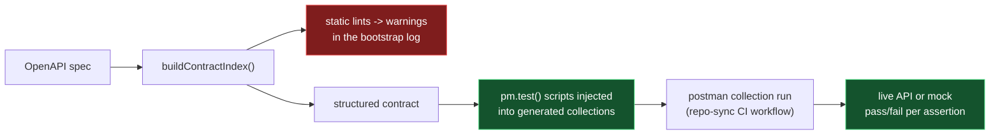

# Postman Onboarding: Workspace Bootstrap

[](https://github.com/postman-cs/postman-bootstrap-action/actions/workflows/ci.yml) [](https://github.com/postman-cs/postman-bootstrap-action/releases) [](https://www.npmjs.com/package/@postman-cse/onboarding-bootstrap) [](LICENSE)

Provisions a [Postman workspace](https://learning.postman.com/docs/collaborating-in-postman/using-workspaces/overview/) from an OpenAPI spec, generating baseline, smoke, and contract collections in one step.

Every generated collection ships with executable contract tests compiled from your spec: OpenAPI request, response, schema, and security checks grounded in the governing RFCs, plus dedicated gRPC, SOAP, GraphQL, AsyncAPI, and MCP lanes. The full test inventory and the standard behind each check: [Generated assertions](docs/generated-assertions.md) and [Multi-Protocol Contract Assertions](docs/MULTIPROTOCOL-ASSERTIONS.md).

Part of the [Postman API Onboarding suite](https://github.com/postman-cs/postman-api-onboarding-action); the composite action's README has the full [action-picker table](https://github.com/postman-cs/postman-api-onboarding-action#which-action-should-i-use).

- [Usage](#usage)
- [Common scenarios](#common-scenarios)
- [Inputs](#inputs) / [Outputs](#outputs)
- [CLI usage (non-GitHub CI)](#cli-usage-non-github-ci)
- [How it works](#how-it-works)
- [Dynamic contract tests](#dynamic-contract-tests)
- [Enforcement layers and error codes](#enforcement-layers-and-error-codes)

## Usage

```yaml
name: Bootstrap Postman workspace
on:
  push:
    branches: [main]

jobs:
  bootstrap:
    runs-on: ubuntu-latest
    steps:
      - uses: actions/checkout@v5
      - id: postman_token
        uses: postman-cs/postman-resolve-service-token-action@v2
        with:
          postman-api-key: ${{ secrets.POSTMAN_API_KEY }}
          postman-region: us
      - uses: postman-cs/postman-bootstrap-action@v2
        with:
          project-name: core-payments
          spec-url: https://raw.githubusercontent.com/postman-cs/postman-bootstrap-action/main/examples/core-payments-openapi.yaml
          postman-region: us
          postman-api-key: ${{ secrets.POSTMAN_API_KEY }}
          postman-access-token: ${{ steps.postman_token.outputs.token }}
          credential-preflight: enforce
```

Provide either `spec-url` (public HTTPS) or `spec-path` (a file in the checked-out repo) for the [Spec Hub import](https://learning.postman.com/docs/design-apis/specifications/import-a-specification/) path.

Mint the `postman-access-token` with the [service-token action](https://github.com/postman-cs/postman-resolve-service-token-action): it is the primary credential and carries every Postman asset operation. A [service account](https://learning.postman.com/docs/administration/service-accounts/) PMAK for `postman-api-key` is optional; it mints and re-mints that access token and logs the Postman CLI in for `spec lint`. See [Obtaining Credentials](docs/credentials.md) for the credential matrix and legacy fallback.

> [!NOTE]
> The action defaults to the US production region (`postman-region: us`). [EU data residency](https://learning.postman.com/docs/administration/enterprise/about-eu-data-residency/) teams should set `postman-region: eu` on this action and on the service-token step that feeds it.

## Common scenarios

### Git-first spec from the repository

Read the OpenAPI document directly from the checked-out workspace instead of hosting it over HTTPS:

```yaml
- uses: actions/checkout@v5
- uses: postman-cs/postman-bootstrap-action@v2
  with:
    project-name: core-payments
    spec-path: apis/core-payments/openapi.yaml
    postman-api-key: ${{ secrets.POSTMAN_API_KEY }}
```

### Safe rerun for an existing service

Pass `workspace-id`, `spec-id`, and existing collection IDs to rerun without creating duplicate Postman assets. When `.postman/resources.yaml` is committed on the checked-out ref, the action reuses its workspace, spec, and collection mappings automatically.

```yaml
- uses: postman-cs/postman-bootstrap-action@v2
  with:
    project-name: core-payments
    workspace-id: ws-123
    spec-id: spec-123
    baseline-collection-id: col-baseline
    smoke-collection-id: col-smoke
    contract-collection-id: col-contract
    spec-url: https://raw.githubusercontent.com/postman-cs/postman-bootstrap-action/main/examples/core-payments-openapi.yaml
    postman-api-key: ${{ secrets.POSTMAN_API_KEY }}
```

### Create a versioned release set

Create a release-scoped spec and collection set instead of refreshing the canonical assets in place:

```yaml
- uses: postman-cs/postman-bootstrap-action@v2
  with:
    project-name: core-payments
    spec-url: https://raw.githubusercontent.com/postman-cs/postman-bootstrap-action/main/examples/core-payments-openapi.yaml
    collection-sync-mode: version
    spec-sync-mode: version
    release-label: v1.1.1
    postman-api-key: ${{ secrets.POSTMAN_API_KEY }}
```

When `release-label` is omitted, the action derives one from the git tag or branch. Details in [Lifecycle Modes](docs/lifecycle-and-operations.md).

### Fail the run on OpenAPI breaking changes

Compare the incoming contract before any Postman mutation. `pr-native` mode diffs the PR target branch version of `spec-path` against the working tree:

```yaml
- uses: actions/checkout@v5
  with:
    fetch-depth: 0
- uses: postman-cs/postman-bootstrap-action@v2
  with:
    project-name: core-payments
    spec-path: apis/core-payments/openapi.yaml
    breaking-change-mode: pr-native
    breaking-target-ref: ${{ github.base_ref }}
    breaking-baseline-spec-path: apis/core-payments/openapi.baseline.yaml
    postman-api-key: ${{ secrets.POSTMAN_API_KEY }}
```

Modes `off`, `previous-spec`, `pr-native`, and `baseline-only` are described in [OpenAPI Spec Handling](docs/spec-handling.md).

### Assign the workspace to a governance group

Set the repository custom property `postman-governance-group`, then provide tokens so the action can perform workspace enrichment:

```yaml
- id: postman-token
  uses: postman-cs/postman-resolve-service-token-action@v2
  with:
    postman-api-key: ${{ secrets.POSTMAN_API_KEY }}
    postman-region: us

- uses: postman-cs/postman-bootstrap-action@v2
  with:
    project-name: core-payments
    spec-url: https://raw.githubusercontent.com/postman-cs/postman-bootstrap-action/main/examples/core-payments-openapi.yaml
    postman-region: us
    github-token: ${{ github.token }}
    postman-api-key: ${{ secrets.POSTMAN_API_KEY }}
    postman-access-token: ${{ steps.postman-token.outputs.token }}
```

For one-off runs, `governance-group` can be passed directly and overrides the repository custom property. `governance-mapping-json` remains supported as a domain-map fallback for older workflows. If the [governance group](https://learning.postman.com/docs/api-governance/configurable-rules/configuring-api-governance-rules/) configuration is missing, the group is not found, or the access token is expired, bootstrap logs a warning and continues with the created workspace, spec, and collections.

### Create the workspace under an org-mode sub-team

Postman organizations with multiple sub-teams require an explicit `workspace-team-id` for workspace creation:

```yaml
- uses: postman-cs/postman-bootstrap-action@v2
  with:
    project-name: core-payments
    spec-url: https://raw.githubusercontent.com/postman-cs/postman-bootstrap-action/main/examples/core-payments-openapi.yaml
    workspace-team-id: ${{ vars.POSTMAN_WORKSPACE_TEAM_ID }}
    postman-api-key: ${{ secrets.POSTMAN_API_KEY }}
```

See [Team Identity](docs/team-identity.md) for sub-team discovery and team-ID derivation.

## Inputs

<!-- inputs-table:start -->
| Name | Description | Required | Default |
| --- | --- | --- | --- |
| `workspace-id` | Existing Postman workspace ID | no |  |
| `spec-id` | Existing Postman spec ID | no |  |
| `baseline-collection-id` | Existing baseline collection ID | no |  |
| `smoke-collection-id` | Existing smoke collection ID | no |  |
| `contract-collection-id` | Existing contract collection ID | no |  |
| `additional-collections-dir` | Workspace-relative directory containing curated Postman v2.1 JSON/YAML files or canonical HTTP collection v3 Local View directories to create or update. | no |  |
| `sync-examples` | Whether linked spec/collection relations should enable example syncing | no | `true` |
| `collection-sync-mode` | Collection lifecycle policy (refresh or version) | no | `refresh` |
| `spec-sync-mode` | Spec lifecycle policy (update or version) | no | `update` |
| `release-label` | Optional release label used for versioned specs and collections | no |  |
| `project-name` | Service project name | yes |  |
| `domain` | Business domain for the service | no |  |
| `domain-code` | Workspace naming prefix | no |  |
| `governance-group` | Postman governance workspace group name. Overrides the postman-governance-group repository custom property and domain mapping. | no |  |
| `requester-email` | Requester email for audit context | no |  |
| `workspace-admin-user-ids` | Comma-separated workspace admin user ids | no |  |
| `workspace-team-id` | Numeric sub-team ID for org-mode workspace creation. Required when your Postman team is an org with multiple sub-teams. Run the action without this input to see available sub-teams listed in the error output. | no |  |
| `spec-url` | HTTPS URL to the OpenAPI document to bootstrap. Provide either spec-url or spec-path. | no |  |
| `spec-path` | Local filesystem path to the OpenAPI document (relative to the workspace). Provide either spec-url or spec-path. | no |  |
| `protocol` | API spec protocol. auto (default) detects from content/extension. openapi flows through Spec Hub; graphql (SDL/introspection), grpc (.proto), and soap (WSDL) build and instrument a Postman collection directly. | no | `auto` |
| `protocol-endpoint-url` | Endpoint URL/authority used by generated non-OpenAPI requests (e.g. {{baseUrl}}/graphql, grpc://host:port). Supports Postman variable interpolation. Ignored for openapi. | no |  |
| `openapi-version` | OpenAPI specification version override (3.0 or 3.1). When not set, the version is auto-detected from the spec content. | no |  |
| `preserve-oas30-type-null` | Opt-in compatibility mode for OpenAPI 3.0 oneOf schemas that pair one normal schema with a null-only member. The action uploads the original source bytes unchanged and uses an internal nullable true view for validation and generated artifacts. All unrelated validation and lint errors remain enforced. | no | `false` |
| `breaking-change-mode` | OpenAPI breaking-change comparison mode (off, pr-native, baseline-only, or previous-spec) | no | `off` |
| `breaking-baseline-spec-path` | Workspace-relative baseline OpenAPI spec path used by baseline-only mode and pr-native fallback | no |  |
| `breaking-rules-path` | Workspace-relative openapi-changes rules file. Missing files are ignored. | no | `changes-rules.yaml` |
| `breaking-target-ref` | Optional target branch or git ref override for pr-native breaking-change comparisons | no |  |
| `breaking-summary-path` | Optional markdown report output path. Defaults to a runner-temp file. | no |  |
| `breaking-log-path` | Optional raw command log output path. Defaults to a runner-temp file. | no |  |
| `governance-mapping-json` | Legacy JSON map of business domain to governance group name. Prefer governance-group or the postman-governance-group repository custom property. | no | `{}` |
| `github-token` | GitHub token used to read the postman-governance-group repository custom property | no |  |
| `gh-fallback-token` | Fallback GitHub token used to read repository custom properties when github-token cannot | no |  |
| `postman-api-key` | Postman service-account API key (PMAK). With a postman-access-token present, the PMAK is used ONLY to mint/re-mint the access token and to log in the Postman CLI for `spec lint` — never for an asset operation. When the key is absent, the CLI spec lint is skipped (governance errors are not enforced). CLI/binary usage may instead set the POSTMAN_API_KEY environment variable. Optional. | no |  |
| `postman-access-token` | Postman service-account access token (x-access-token). Primary credential — every asset operation (workspace create/visibility, spec upload/update, collection generation/read/mutation, test injection, tagging, team-scope) runs through the access-token gateway. Mint it with postman-resolve-service-token-action. CLI/binary usage may instead set the POSTMAN_ACCESS_TOKEN environment variable (e.g. Jenkins withCredentials). Optional only for legacy PMAK-only runs; supply it for the gateway path. | no |  |
| `credential-preflight` | Credential identity preflight policy. warn (default) logs a note and continues when postman-api-key and postman-access-token resolve to different parent orgs; enforce fails the run on that condition before any workspace is created. | no | `warn` |
| `branch-strategy` | Branch-aware sync strategy. legacy (default) keeps branch-blind behavior; publish-gate restricts canonical writes to the canonical branch and runs credential-free static validation on other branches; preview additionally maintains suffixed per-branch preview asset sets. | no | `legacy` |
| `canonical-branch` | Explicit canonical branch (the sole writer of canonical assets). Defaults to the provider-resolved default branch; required on providers without a default-branch variable (Bitbucket, Azure DevOps) when branch-strategy is not legacy. | no |  |
| `channels` | Comma-separated channel map for long-lived promotion branches, e.g. "develop=DEV, staging=STAGE, release/*=RC". Channel branches maintain prefix-named parallel asset sets and never mutate canonical assets. | no |  |
| `folder-strategy` | Folder organization strategy for generated collections (Paths or Tags) | no | `Paths` |
| `nested-folder-hierarchy` | When folder-strategy is Tags, enables nested folder hierarchy | no | `false` |
| `request-name-source` | Determines how requests are named in generated collections (Fallback or URL) | no | `Fallback` |
| `postman-region` | Postman data residency region for public API and Postman CLI calls. | no | `us` |
<!-- inputs-table:end -->

## Outputs

<!-- outputs-table:start -->
| Name | Description | Required | Default |
| --- | --- | --- | --- |
| `workspace-id` | Postman workspace ID | n/a | n/a |
| `workspace-url` | Postman workspace URL | n/a | n/a |
| `workspace-name` | Postman workspace name | n/a | n/a |
| `spec-id` | Uploaded Postman spec ID | n/a | n/a |
| `baseline-collection-id` | Baseline collection ID | n/a | n/a |
| `smoke-collection-id` | Smoke collection ID | n/a | n/a |
| `contract-collection-id` | Contract collection ID | n/a | n/a |
| `collections-json` | JSON summary of generated collections | n/a | n/a |
| `lint-summary-json` | JSON summary of lint errors and warnings. When postman-api-key is absent the CLI lint is skipped and this is { status: "skipped", reason: "no postman-api-key" }. | n/a | n/a |
| `breaking-change-status` | OpenAPI breaking-change check status | n/a | n/a |
| `breaking-change-summary-json` | JSON summary of the OpenAPI breaking-change check | n/a | n/a |
| `sync-status` | Branch-aware sync status: synced, skipped-branch-gate, or empty under branch-strategy legacy. | n/a | n/a |
| `branch-decision` | Serialized BranchDecision JSON for downstream actions (also exported as POSTMAN_BRANCH_DECISION). | n/a | n/a |
| `spec-version-tag` | Native Spec Hub version tag applied on this canonical publish (tag-per-publish), empty when tagging was skipped (no-op sync, non-canonical run, or legacy client). | n/a | n/a |
| `spec-version-url` | Reserved for the repo-sync finalizer; bootstrap does not tag before complete onboarding. | n/a | n/a |
| `spec-content-changed` | Whether bootstrap changed canonical spec content; repo-sync uses this to skip native version tags on no-op syncs. | n/a | n/a |
<!-- outputs-table:end -->

Regenerate both tables from `action.yml` with `npm run docs:tables`.

## CLI usage (non-GitHub CI)

The same bootstrap is available as a CLI for GitLab CI, Bitbucket Pipelines, Azure DevOps, and other CI systems. GitHub Actions users should continue using the `action.yml` interface.

```bash
npm install -g @postman-cse/onboarding-bootstrap

postman-bootstrap \
  --project-name core-payments \
  --spec-url https://raw.githubusercontent.com/postman-cs/postman-bootstrap-action/main/examples/core-payments-openapi.yaml \
  --postman-api-key "$POSTMAN_API_KEY" \
  --postman-access-token "$POSTMAN_ACCESS_TOKEN" \
  --result-json bootstrap-result.json \
  --dotenv-path bootstrap.env
```

The CLI package supports Node.js 24+ to match the GitHub Action runtime. It auto-detects the CI provider from environment variables for GitHub, GitLab, Bitbucket, and Azure DevOps, writes JSON to stdout, and sends all logs to stderr. Use `--result-json` to write the JSON payload to a file and `--dotenv-path` to emit shell-sourceable `KEY=VALUE` output with the `POSTMAN_BOOTSTRAP_` prefix.

Example GitLab CI job:

```yaml
bootstrap:
  image: node:24
  script:
    - npm install -g @postman-cse/onboarding-bootstrap
    - postman-bootstrap --project-name core-payments --spec-url "https://raw.githubusercontent.com/postman-cs/postman-bootstrap-action/main/examples/core-payments-openapi.yaml" --postman-api-key "$POSTMAN_API_KEY" --postman-access-token "$POSTMAN_ACCESS_TOKEN" --result-json bootstrap-result.json --dotenv-path bootstrap.env
  artifacts:
    paths:
      - bootstrap-result.json
      - bootstrap.env
```

The same command works verbatim on any Node 24 runner: Bitbucket Pipelines with a `node:24` image, or Azure DevOps after a `NodeTool@0` step with `versionSpec: '24.x'`.

### Self-contained binary (no npm / no Node)

For CI that cannot install npm or Node — locked-down Jenkins, bare Bitbucket agents, boxes with no package-registry access — a single self-contained executable is published as a GitHub Release asset. It bakes the Node runtime and the full bundle into one file, so the target needs no npm, no Node install, and no package-registry access. It is not network-isolated: the run still needs outbound access to the Postman API/gateway.

```bash
VERSION=2.9.10
curl -fsSL -o postman-bootstrap \
  "https://github.com/postman-cs/postman-bootstrap-action/releases/download/v${VERSION}/postman-bootstrap-${VERSION}-linux-x64"
chmod +x postman-bootstrap

export POSTMAN_ACCESS_TOKEN="<minted-token>"
./postman-bootstrap --project-name core-payments --spec-path ./openapi.yaml --result-json bootstrap-result.json
```

Credentials resolve from a CLI flag, then the `INPUT_*` env var, then a plain `POSTMAN_ACCESS_TOKEN` / `POSTMAN_API_KEY` — so Jenkins `withCredentials` works with no flag. Access-token-only runs pull no extra tooling onto the agent **as long as the two optional download paths stay off** (their defaults): `postman-api-key` enables lint (installs the Postman CLI via `curl`), and `breaking-change-mode` with a comparison source downloads the `pb33f/openapi-changes` tarball. Current target is `linux-x64`. Full runbook, credential minting, the Postman host allowlist, and a Jenkins pipeline: [Self-contained binary](docs/self-contained-binary.md).

## How it works

The action handles the bootstrap slice of the Postman onboarding workflow: create or reuse a Postman workspace, assign governance, invite the requester and workspace admins, upload or update the spec in [Spec Hub](https://learning.postman.com/docs/design-apis/specifications/overview/), lint it with the [Postman CLI](https://learning.postman.com/docs/postman-cli/postman-cli-governance/), generate or reuse baseline, smoke, and contract collections, inject generated tests, apply tags, and reuse committed `.postman/resources.yaml` state when present. Inputs and outputs use kebab-case.

- **Phase independence:** bootstrap succeeds on its own even when later pipeline stages fail, and reruns reuse existing assets. See [Bootstrap Phase Independence](docs/bootstrap-phase-independence.md).
- **Team identity:** the team ID is resolved from the access-token session identity; org-mode tenants pass `workspace-team-id`. See [Team Identity](docs/team-identity.md).
- **Git providers:** workspace-to-repository linking supports GitHub and GitLab, cloud and self-hosted. See [Git Provider Support](docs/git-provider-support.md).
- **Spec handling:** operation summaries are normalized before upload, `spec-url` fetches are SSRF-hardened HTTPS with pinned DNS, and breaking-change comparison runs before any Postman mutation when enabled. See [OpenAPI Spec Handling](docs/spec-handling.md).
- **Lifecycle modes:** `collection-sync-mode` (`refresh`/`version`, legacy `reuse`), `spec-sync-mode` (`update`/`version`), release-label derivation, ref-native state, cloud spec-to-collection syncing, and smoke monitoring. See [Lifecycle Modes and Operational Reference](docs/lifecycle-and-operations.md).
- **Credentials:** `postman-access-token` is the primary credential for every asset operation; the optional `postman-api-key` powers access-token minting and the Postman CLI `spec lint` login. See [Obtaining Credentials](docs/credentials.md).
- **Protocol write split:** GraphQL and SOAP build v2.1.0 collections through the public collections API with `postman-api-key`. gRPC builds a v3/Extensible Collection through the gateway EC API, which is access-token only — so gRPC **hard-requires** `postman-access-token` and fails fast with `EC_REQUIRES_ACCESS_TOKEN` when it is absent. See [Multi-Protocol Contract Assertions](docs/MULTIPROTOCOL-ASSERTIONS.md).

## Dynamic contract tests

Before any durable contract collection is overwritten, the action hardens the generated `[Contract]` collection against the resolved OpenAPI 3.0/3.1 document: it bundles and validates the spec, requires exactly one generated request per eligible operation, instruments each request with OpenAPI-derived runtime checks (status codes, headers, body presence, `Content-Type`, JSON schemas, security credential presence, request parameter and body values), and enforces script safety and size gates. Spec updates capture the previous content hash so failed runs can roll back, and refresh mode stages generated collections before touching durable ones.

Full pipeline, validation scope, OpenAPI semantics, limits, and rollback behavior: [Dynamic Contract Tests](docs/dynamic-contract-tests.md). The user-facing inventory — exact test names per protocol, the RFC each check enforces, and what to do when one fails — is in [Generated Assertions](docs/generated-assertions.md).

## Enforcement layers and error codes

The action enforces the OpenAPI contract at three points with three failure modes. The full architecture — what runs at bootstrap time versus inside the CI collection run, and why the same RFC rule appears in more than one layer — is in [Contract Enforcement Layers](docs/contract-enforcement-layers.md).

| Layer | When | Effect |
| --- | --- | --- |
| Postman CLI `spec lint` | Bootstrap | Fails the run on lint errors (PMAK-gated) |
| Static document lints | Bootstrap | Warnings only: spec-shape defects and runtime-coverage disclosures, logged and never fatal |
| Runtime contract tests | Every CI collection run | `pm.test()` pass/fail against the live response |



Static lints catch the spec lying (a HEAD operation declaring a body, a 304 on a POST); runtime tests catch the server lying (a 200 where only 201 is declared, a body that fails its schema). Bootstrap-time failures use `CONTRACT_*` codes and stop the run before durable collections are overwritten; warnings are logged and never gate the run.

Representative codes:

| Error code | Layer | Effect | Meaning |
| --- | --- | --- | --- |
| `CONTRACT_SPEC_VALIDATION_FAILED` | Spec loading | Fails the run | The bundled document failed OpenAPI validation |
| `CONTRACT_OPERATION_COVERAGE_FAILED` | Instrumentation | Fails the run | Generated collection did not cover every eligible operation |
| `CONTRACT_HEAD_RESPONSE_BODY` | Static lint | Warning | A HEAD operation declares response content (RFC 9110) |
| `CONTRACT_SCHEMA_NOT_COMPILED` | Disclosure | Warning | One schema could not be compiled; its runtime check is skipped and disclosed |

The complete catalog of all 142 codes, grouped by layer with per-code remediation, is in [Contract Error Codes](docs/contract-error-codes.md).

## Resources

- npm package: [@postman-cse/onboarding-bootstrap](https://www.npmjs.com/package/@postman-cse/onboarding-bootstrap)
- Docs in this repo: [credentials](docs/credentials.md), [self-contained binary](docs/self-contained-binary.md), [spec handling](docs/spec-handling.md), [lifecycle modes](docs/lifecycle-and-operations.md), [team identity](docs/team-identity.md), [generated assertions](docs/generated-assertions.md), [contract error codes](docs/contract-error-codes.md)
- Marketplace docs: [Support](SUPPORT.md), [Security Policy](SECURITY.md), [Release Policy](RELEASE_POLICY.md)
- Postman references: [Postman API](https://learning.postman.com/docs/reference/postman-api/intro-api/), [API authentication](https://learning.postman.com/docs/reference/postman-api/authentication/), [service accounts](https://learning.postman.com/docs/administration/service-accounts/), [Spec Hub](https://learning.postman.com/docs/design-apis/specifications/overview/), [generate collections](https://learning.postman.com/docs/design-apis/specifications/generate-collections/), [Postman CLI governance](https://learning.postman.com/docs/postman-cli/postman-cli-governance/)

Local development: `npm install`, `npm test`, `npm run typecheck`, `npm run build` (produces the committed `dist/` bundles used by `action.yml`).

## Telemetry

The action sends one anonymous usage event per run (action name/version, outcome, coarse CI metadata; never secrets, spec content, or repo names). Disable with `POSTMAN_ACTIONS_TELEMETRY=off` or `DO_NOT_TRACK=1`; route events to your own collector with `POSTMAN_ACTIONS_TELEMETRY_ENDPOINT`.

## License

[MIT](LICENSE)
