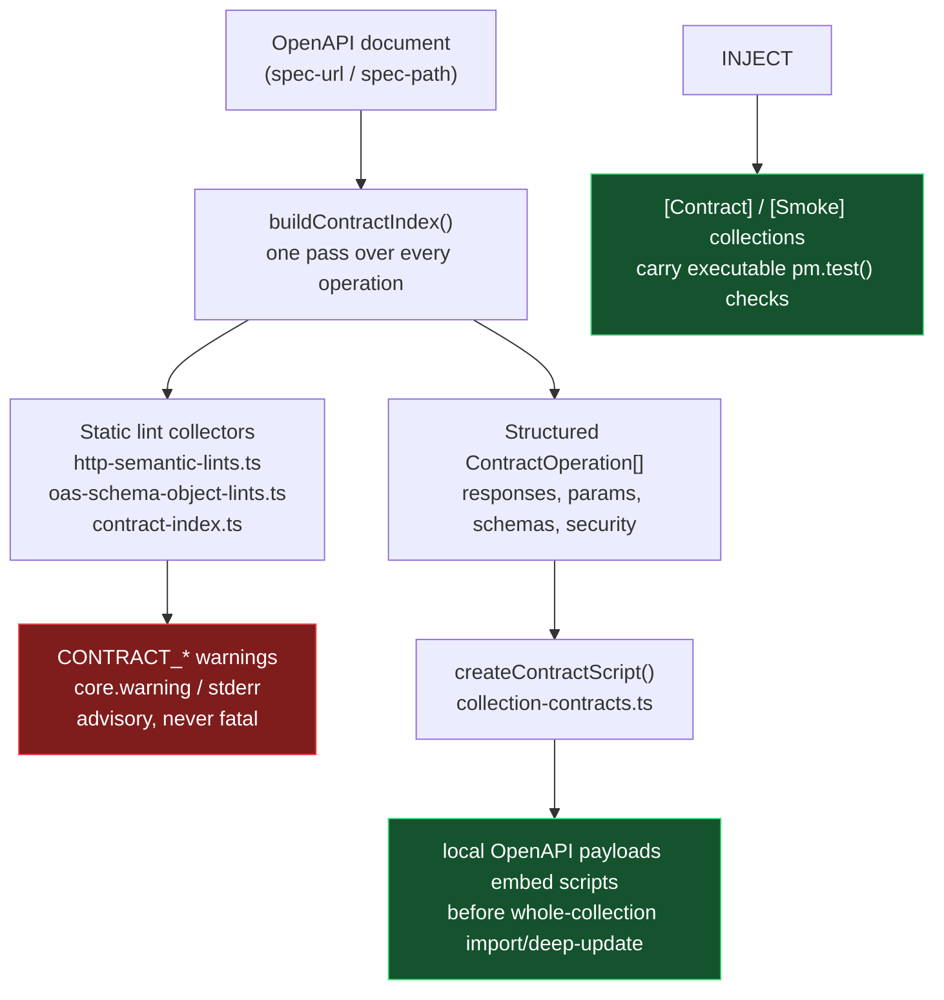
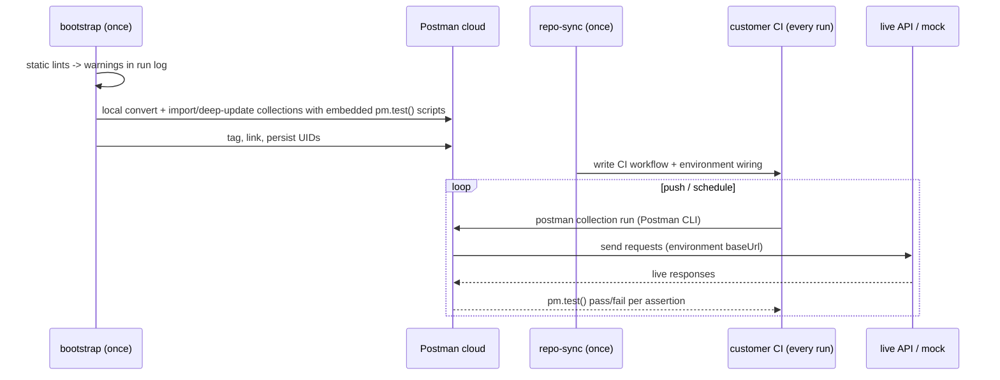

# Contract Enforcement Layers

The bootstrap action enforces the same OpenAPI contract at three distinct points, with three distinct failure modes. This page explains what runs where, what each layer can and cannot see, and why a rule from the same RFC often appears in more than one layer.

| Layer | When it runs | What it inspects | Effect |
| --- | --- | --- | --- |
| Postman CLI `spec lint` | Bootstrap time | The uploaded Spec Hub spec, via Postman's ruleset engine | Fails the run on lint errors (PMAK-gated; skipped without `postman-api-key`) |
| Static document lints | Bootstrap time | The parsed OpenAPI document | Warning only; logged, never fails, never becomes a test |
| Runtime contract tests | Every CI collection run | The live HTTP response | `pm.test()` pass/fail against the actual server |

## One index, two outputs

Both bespoke layers derive from a single pass: `buildContractIndex(parseOpenApiDocument(document))` (`src/lib/spec/openapi-loader.ts`, `src/lib/spec/contract-index.ts`). That pass walks every operation and produces two independent outputs side by side:

1. **Static lint warnings** -- collected by `collectDocumentStaticLints`, `collectOperationStaticLints`, `collectSchemaStaticLints`, `collectSecurityStaticLints` (all in `contract-index.ts`), `collectHttpSemanticStaticLints` (`http-semantic-lints.ts`), and `collectSchemaObjectLints` (`oas-schema-object-lints.ts`). Each returns `CONTRACT_*` warning strings.
2. **The structured contract** -- declared responses, parameter checks, request-body schemas, security requirements, assembled into `ContractOperation` records.

The warning strings and the test scripts never feed each other. Runtime scripts are compiled from the structured contract data, not from the lint output.

## What each layer can see

**Static lints catch the spec lying.** They flag document properties no live response could ever reveal: a HEAD operation declaring response content (`CONTRACT_HEAD_RESPONSE_BODY` -- a HEAD body is empty by definition, so a runtime test could never catch the spec's claim), a 304 declared on a POST (`CONTRACT_304_METHOD`), an unparseable server URL, an OAuth token modeled in the query string. These are properties of the document, checked once, surfaced as warnings, and never enforced at runtime.

**Runtime tests catch the server lying.** They assert behavior the document cannot prove: the server returns 200 where the spec only defines 201, the `Content-Type` does not match any declared media type, the body fails its JSON Schema, a required response header is missing from the actual reply. The full runtime test inventory is in [Generated Assertions](generated-assertions.md); the generation pipeline is in [Dynamic Contract Tests](dynamic-contract-tests.md).

The same RFC rule often appears in both layers because each enforcement point sees a different failure. RFC 9110's "304 only for GET/HEAD" is one rule with two liars to catch:

- Static: `CONTRACT_304_METHOD` warns when the *document* declares a 304 on a non-GET/HEAD operation.
- Runtime: the injected status-code test fails when the *server* actually answers with a status the operation never declared.

Neither subsumes the other.

## Who runs the collection

Nothing executes the embedded tests at bootstrap time. Bootstrap only prepares the assets: it converts OpenAPI locally into complete baseline/smoke/contract payloads (scripts already embedded), imports or deep-updates whole collections, tags them, and persists the UIDs to `.postman/resources.yaml` and repo variables.

The execution loop belongs to [postman-repo-sync-action](https://github.com/postman-cs/postman-repo-sync-action): it writes a CI workflow into the consuming repository that resolves the smoke and contract collection UIDs plus the environment UID, then runs `postman collection run <uid> -e <environment-uid> --report-events` with the Postman CLI on push and on schedule. The environment's `baseUrl` -- seeded from repo-sync's `env-runtime-urls-json` input, or a Postman mock URL when one was created -- decides what the requests actually hit.

Static lints fire once, at bootstrap, against the document. Runtime tests fire on every CI run, against the reply. Two layers, two moments, two truths being checked.

## The bridge: coverage disclosures

Where a runtime validator cannot be built, a warning documents the gap so the skip is never invisible:

- `CONTRACT_SCHEMA_NOT_COMPILED` -- a schema the validator engine refused to compile degrades to a runtime skip, and the generated collection carries a disclosure test that enumerates every skipped schema inside the run report.
- `CONTRACT_NONJSON_SCHEMA_NOT_VALIDATED` -- a non-JSON response schema cannot be validated at runtime; Content-Type and body-presence checks still apply.
- The wider `*_NOT_VALIDATED` / `*_ADVISORY` family -- problem+json member shapes, `Link` header grammar, parameter serializations the runtime cannot decode -- names exactly which check is statically unprovable and not runtime-checked.

Every code, its layer, and its effect on the run is cataloged in [Contract Error Codes](contract-error-codes.md).

## How this differs from Spectral-style linting

The Postman CLI `spec lint` step (`lintSpecViaCli` in `src/index.ts`) is the ruleset-engine layer: declarative rules, a violations report, and a hard failure on errors. It is PMAK-gated and covers OpenAPI structural and governance rules.

The static lint collectors are a bespoke imperative analyzer, not a rules engine. They exist because the RFC-semantic checks they cover -- HEAD bodies, 304 method scope, 206 `Content-Range` parity, 401 `WWW-Authenticate`, RFC 9457 problem members, token-in-query leaks -- are protocol-correctness rules from RFC 9110, RFC 6750, RFC 9457, RFC 8288, and friends, not OpenAPI structural rules, and no default ruleset checks them. They run in-process inside the bundled action, need no external linter, and cost nothing to keep on.
